# 📚 Bookie Dookie — Online Library Management System

A web-based library platform that allows users to browse, borrow, and manage books online. The system supports two roles: **User** and **Admin**, each with dedicated interfaces and functionality.

> Built with **HTML**, **CSS**, **JavaScript**, and **jQuery**, connected to a **Django** backend via REST APIs.

### 🔗 [Live Demo (Front-End)](https://abdelrahmanyr.github.io/Bookie-Dookie/)
> **Note:** The backend server is hosted locally, so only the front-end UI is available in the live demo.

---

## Features Overview

| Role  | Capabilities                                                  |
|-------|---------------------------------------------------------------|
| User  | Browse books, borrow/return, manage wishlist, search & filter |
| Admin | Add/edit/delete books, view dashboard stats, manage users     |

---

## Pages

### 1. Home Page — `index.html`
Landing page with hero section, about us, and contact form.

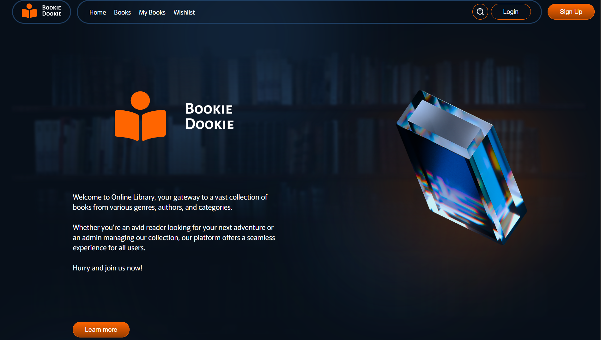

### 2. Login — `login.html`
User authentication with username and password.


### 3. Sign Up — `signup.html`
Account registration with User/Admin role toggle switch.


### 4. Books — `books.html`
Browse all available books with borrow and wishlist actions.

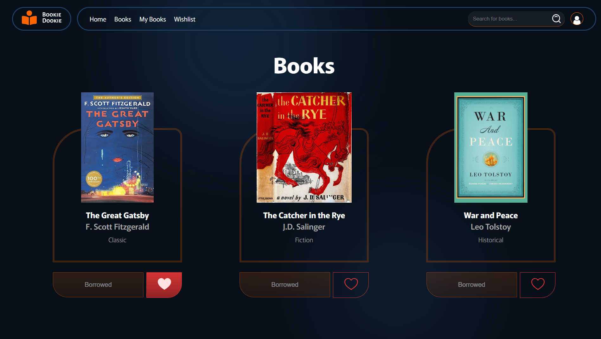

### 5. Book Details — `book_details.html`
Detailed view of a selected book with description, borrow, and wishlist buttons.

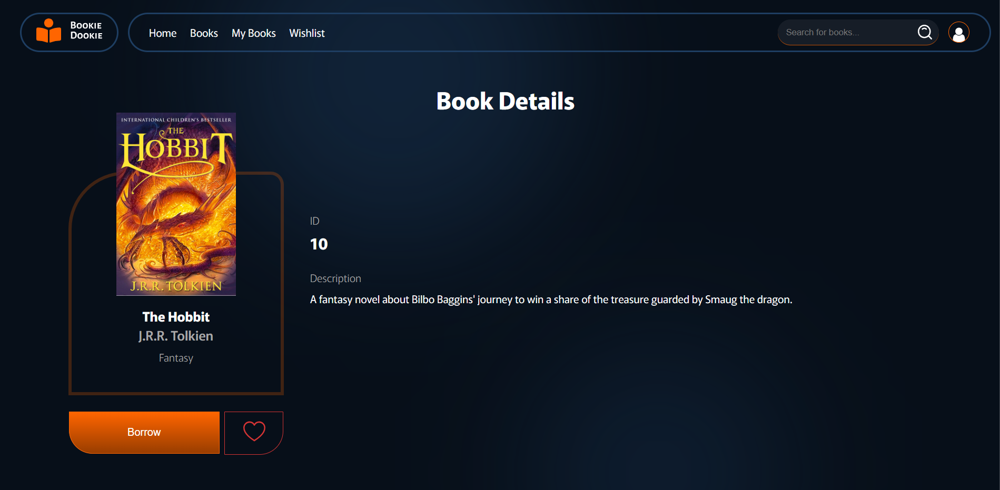

### 6. My Books — `mybooks.html`
View currently borrowed books with borrow/return dates and return action.

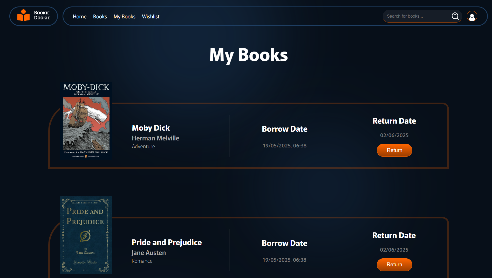

### 7. Wishlist — `wishlist.html`
View and manage wishlisted books.

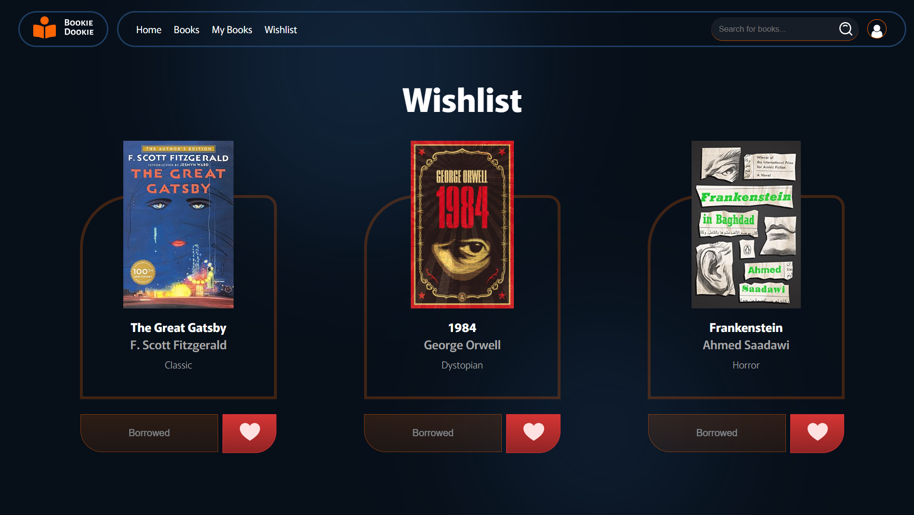

### 8. Admin Dashboard — `dashboard.html`
Overview cards (total users, total books, borrowed books) and paginated users table.

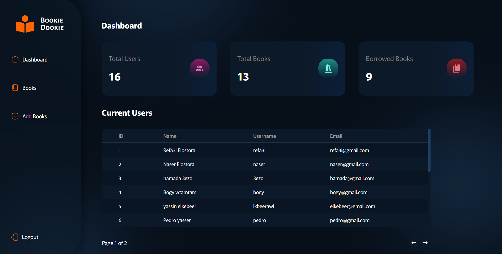

### 9. Admin Books — `admin_books.html`
Paginated book list with edit and delete actions per row.

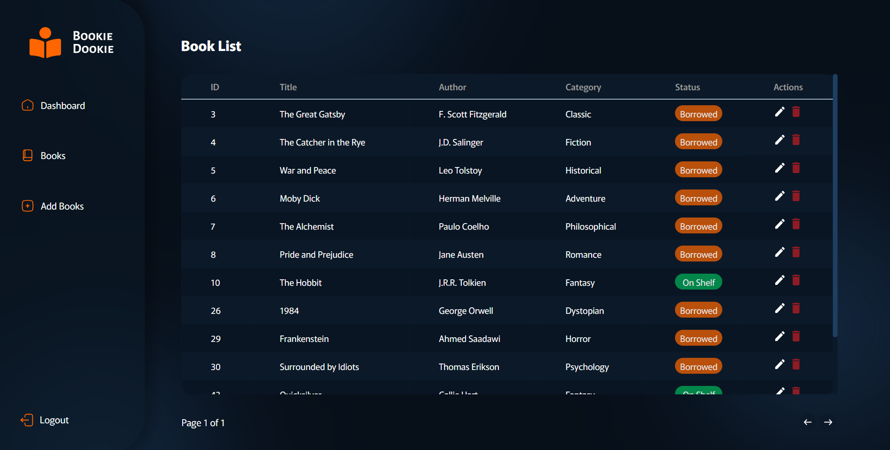

### 10. Add / Edit Book — `add_books.html`
Form to add a new book or edit an existing one (auto-populated via URL params).

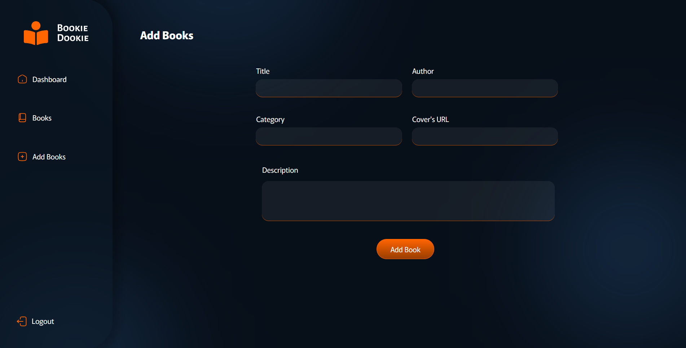

---

## UI / Design Features

- **Custom Alert Popup** — Styled modal alert replacing the default browser `alert()`, used across all pages for success/error messages.

  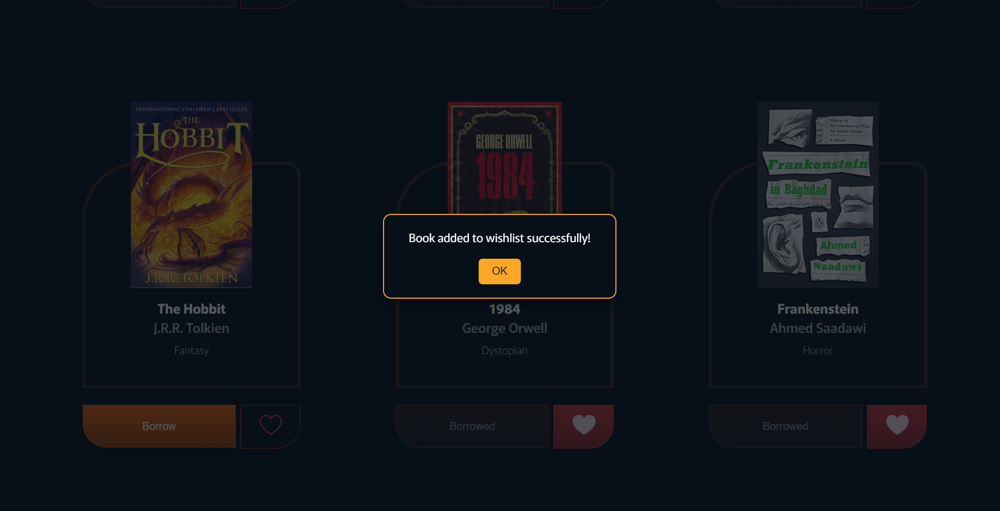

- **Profile Dropdown Menu** — Toggleable dropdown after login with links to My Books, Wishlist, and Logout.

  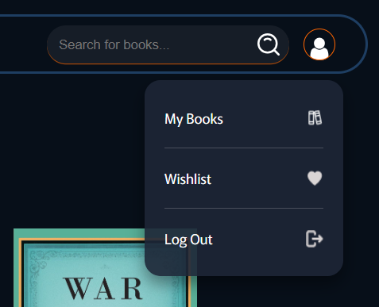

- **User/Admin Role Toggle** — Animated CSS switch on the sign-up form to select account type.

  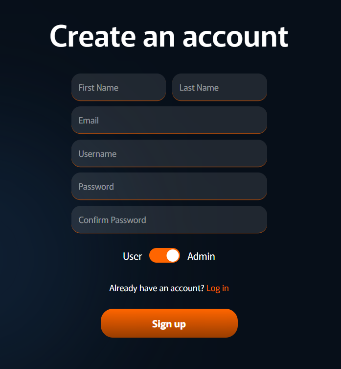

- **Search Bar Expansion** — Click-to-reveal animated search field in the navbar.

  <p>&nbsp;</p>

- **Styled Action Buttons** — Consistent button styles: borrow/borrowed states, heart fill/unfill for wishlist, edit/delete icons for admin.

  

- **Status Badges** — Color-coded "On Shelf" / "Borrowed" tags in the admin book table.

  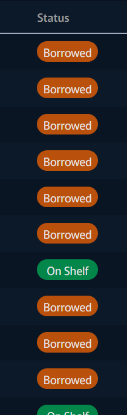

- **Pagination Controls** — Arrow-based page navigation for users table and book list in admin panel.

  

- **Contact Form** — Styled form with first/last name, email, phone, and message fields.

  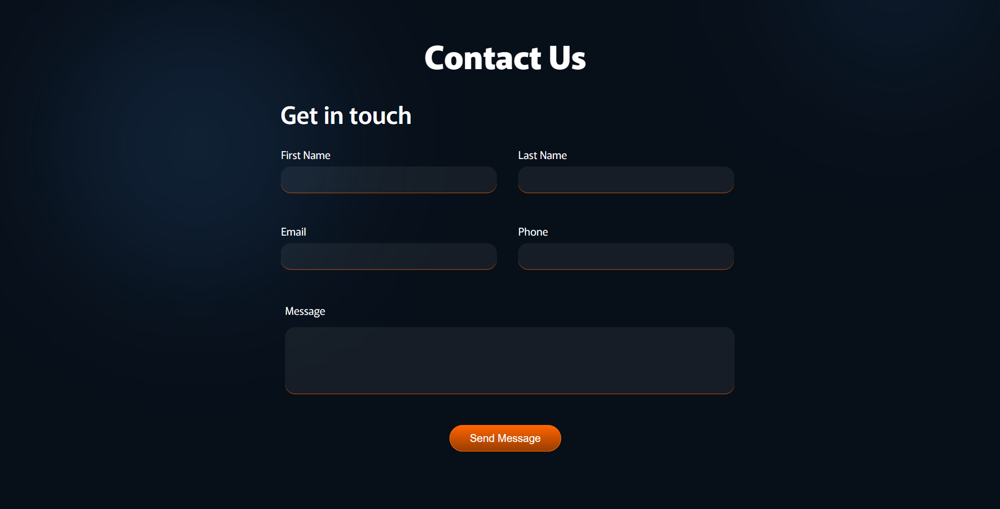

---

## JavaScript Interactivity

| Feature | Description |
|---------|-------------|
| **Authentication** | Login/signup with form validation (email format, password length, confirm match) via AJAX to Django backend |
| **Session Management** | CSRF token handling, cookie-based auth; UI adapts dynamically to logged-in/logged-out state |
| **Dynamic Book Rendering** | Books, wishlist, and borrowed books are fetched from the API and rendered as card components |
| **Borrow / Return** | Borrow and return books with instant UI refresh via AJAX calls |
| **Wishlist Toggle** | Add/remove books from wishlist with heart icon state change |
| **Live Search** | Real-time filtering of books by title, author, or category on Books, Wishlist, and My Books pages |
| **Book Details Navigation** | Click a book card to navigate to its detail page via URL query parameters |
| **Admin CRUD** | Add, edit (pre-filled form), and delete books from the admin panel |
| **Dashboard Stats** | Total users, total books, and borrowed count fetched and displayed dynamically |
| **Paginated Tables** | Client-side pagination for users and books tables with page tracking |
| **Profile Dropdown** | Dynamically injected profile menu with toggle visibility on click |
| **Dynamic Header Sizing** | Header element height auto-adjusts to match full page scroll height |

---

## Project Structure

```
Bookie-Dookie/
├── index.html              # Home / Landing page
├── login.html              # Login page
├── signup.html             # Sign up page
├── books.html              # Browse books
├── book_details.html       # Single book view
├── mybooks.html            # Borrowed books
├── wishlist.html           # User wishlist
├── dashboard.html          # Admin dashboard
├── admin_books.html        # Admin book management
├── add_books.html          # Add / Edit book form
├── assets/                 # Images, logos, SVGs
├── icons/                  # UI icons
├── scripts/
│   ├── index.js            # Navbar, auth state, search bar, profile dropdown, logout
│   ├── users.js            # Login & signup form handling, validation
│   ├── book_features.js    # Book display, borrow, return, wishlist, search, details
│   ├── add_books.js        # Add/edit book form logic
│   ├── admin.js            # Dashboard stats, users/books tables, pagination, delete/edit
│   └── book_data.json      # Static book data reference
└── style/
    ├── general.css         # Shared styles (navbar, footer)
    ├── home.css            # Home page
    ├── login.css           # Login page
    ├── signup.css          # Sign up page
    ├── books.css           # Books grid / cards
    ├── book_details.css    # Book details page
    ├── mybooks.css         # My Books page
    ├── dashboard.css       # Admin dashboard
    ├── admin_books.css     # Admin books table
    ├── add_books.css       # Add book form
    └── Alerts.css          # Custom alert modal
```

---

## Tech Stack

- **Frontend:** HTML5, CSS3, JavaScript (ES6)
- **Libraries:** jQuery 3.5.1
- **Backend:** Django (REST API)
- **Auth:** Session-based with CSRF tokens
